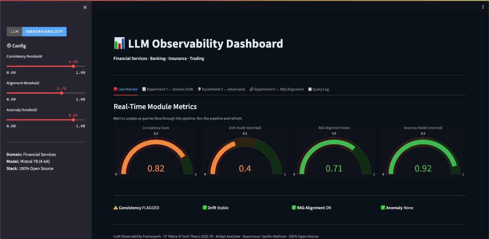
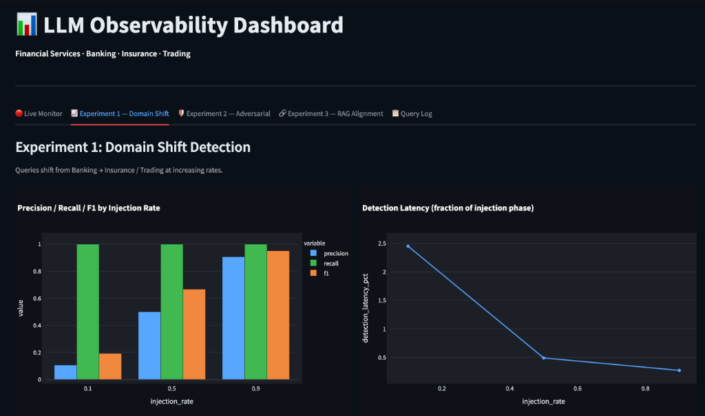
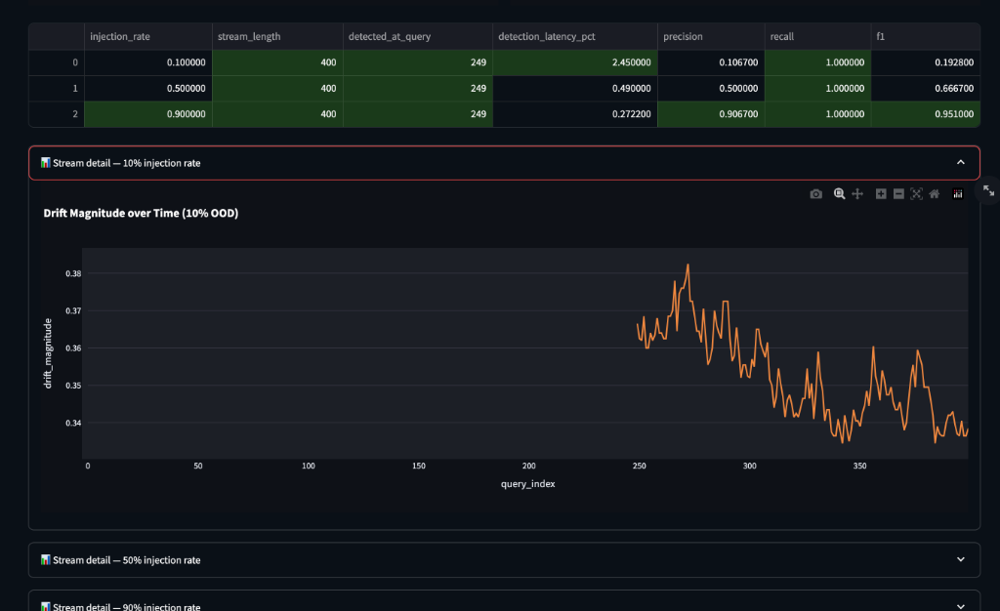
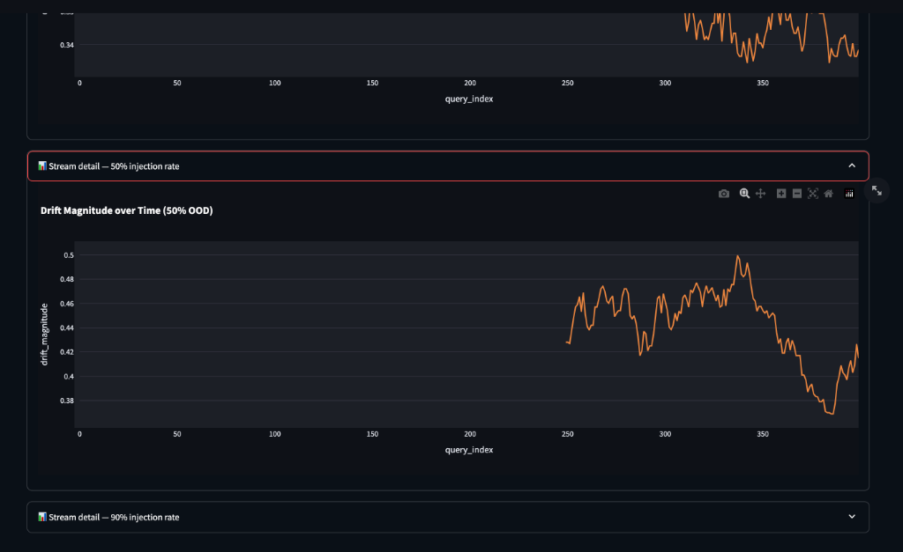
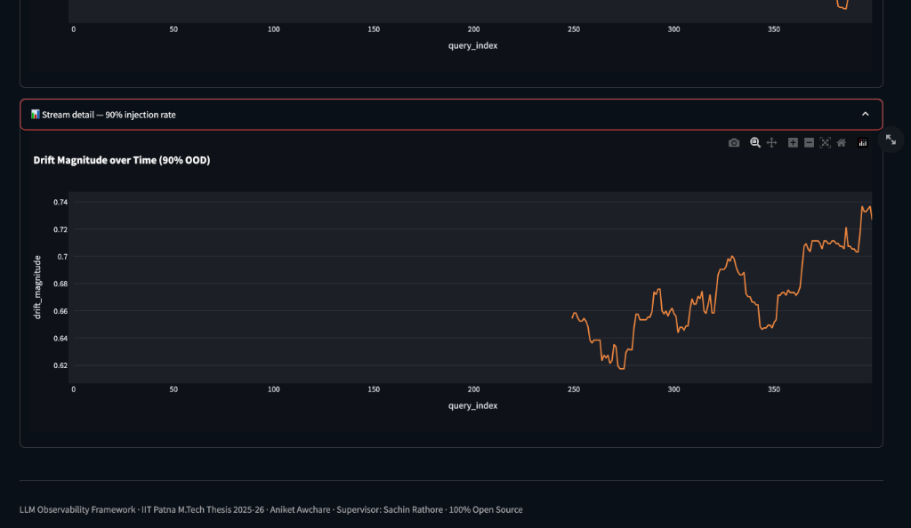
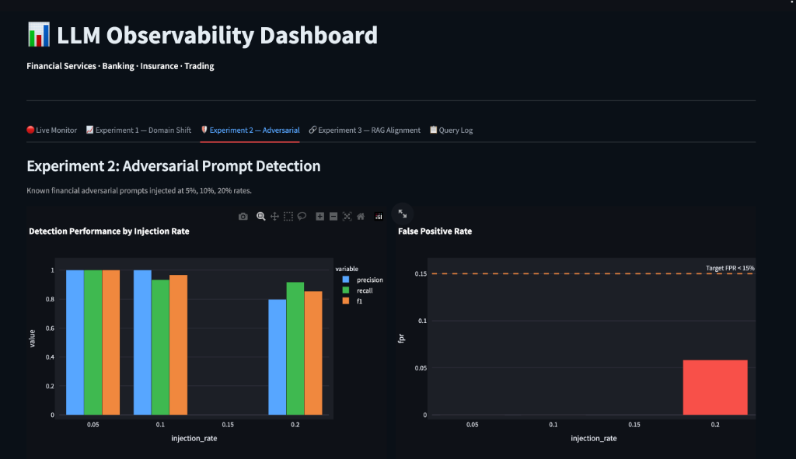
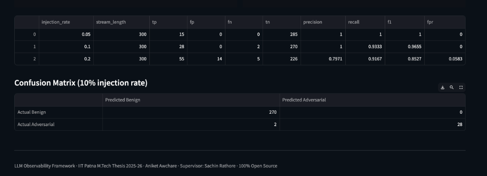
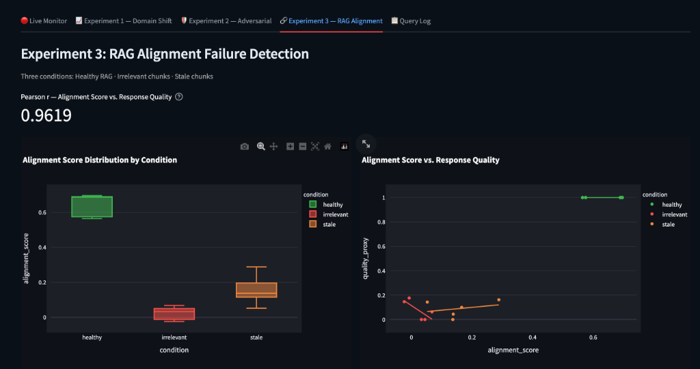
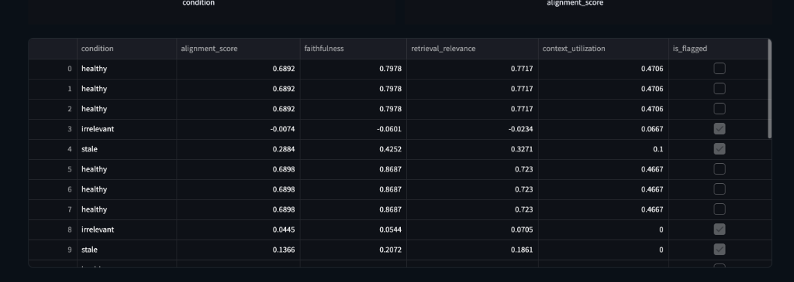

# A Framework for Observability and Reliability in Production Large Language Model Systems

**By**
**Aniket Awchare**
**(Roll No: _________)**

**Under the supervision of**
**Mr. Sachin Rathore**
**Lead System Software Engineer, Cloud Software Group**

**A thesis submitted in partial fulfillment of the requirements for the degree of**
**Executive Master of Technology**
**in**
**Artificial Intelligence and Data Science**

**Indian Institute of Technology Patna**
**Bihta, Patna - 801106, Bihar, India**
**May 2026**

---

## DECLARATION

I certify that:
a. The work contained in this thesis is original and has been done by me under the guidance of my supervisor.
b. The work has not been submitted to any other Institute for any degree or diploma.
c. I have followed the guidelines provided by the Institute in preparing the thesis.
d. I have conformed to the norms and guidelines given in the Ethical Code of Conduct of the Institute.
e. Whenever I have used materials (data, theoretical analysis, figures, and text) from other sources, I have given due credit to them by citing them in the text of the thesis and giving their details in the references. Further, I have taken permission from the copyright owners of the sources, whenever necessary.

Signature: ______________________
Name: Aniket Awchare
Roll No: _________
Date: ______________

---

## CERTIFICATE

This is to certify that the thesis report entitled **"A Framework for Observability and Reliability in Production Large Language Model Systems"**, submitted by **Aniket Awchare** to Indian Institute of Technology Patna, is a record of bona fide project work carried out by him under my supervision and guidance. This thesis in my opinion, is worthy of consideration for the award of the degree of Executive Master of Technology in Artificial Intelligence and Data Science in accordance with the regulations of the Institute.

Signature: ______________________
Name: Mr. Sachin Rathore
Designation: Lead System Software Engineer
Organization: Cloud Software Group
Date: ______________

---

## ACKNOWLEDGEMENTS

I would like to express my sincere gratitude to my supervisor, Mr. Sachin Rathore, for his invaluable guidance, support, and patience throughout this project. His deep industry expertise, technical acumen, and insightful feedback were instrumental in shaping the direction and depth of this research. The regular discussions we had provided me with the clarity and motivation required to tackle complex problems in LLM observability.

I also extend my heartfelt thanks to the distinguished faculty members of the Artificial Intelligence and Data Science department at IIT Patna. Their excellent instruction, rigorous academic curriculum, and continuous support throughout the Executive M.Tech program have laid a strong foundation for my understanding of advanced machine learning concepts.

Furthermore, I would like to thank my colleagues at Autodesk India for their continuous encouragement, technical discussions, and understanding during my studies. Balancing professional commitments with rigorous academic research would not have been possible without a supportive work environment.

Finally, I dedicate this work to my family. Their unwavering belief in my potential, endless patience, and moral support have been my greatest pillars of strength throughout this journey.

---

## ABSTRACT

Enterprise adoption of Large Language Models (LLMs) has accelerated at an unprecedented rate, moving from experimental sandbox environments to mission-critical production systems. However, the monitoring infrastructure surrounding these models has not kept pace with their rapid deployment. Unlike traditional software systems that fail deterministically and loudly—by throwing exceptions or crashing—LLMs fail silently. They can produce responses that are grammatically coherent, contextually plausible, but factually incorrect (hallucinations), drift over time in response to shifting user behavior, or succumb to adversarial prompt injections. Existing evaluation methods primarily rely on offline, static benchmarks which fail to capture the dynamic, constantly shifting distribution of live production queries. Consequently, organizations operating LLMs in high-stakes environments, such as financial services, are often flying blind, relying on proxy metrics like latency and throughput rather than assessing the actual reliability and safety of the generated content.

This thesis introduces a comprehensive, near-real-time observability and reliability framework designed specifically for production LLM systems in the financial services domain. The proposed framework operates as a decoupled, non-intrusive monitoring layer that assesses system health without requiring ground-truth labels for every query or invoking expensive, high-latency "LLM-as-a-judge" secondary models. Instead, it relies on computationally efficient embedding-based metrics, statistical testing, and ensemble anomaly detection to provide actionable leading indicators of model degradation.

The framework comprises four core operational modules. First, a Response Consistency Scorer evaluates stochastic uncertainty by measuring semantic variation across paraphrased inputs using cosine similarity and ROUGE-L overlap. Second, a Semantic Drift Detector utilizes rolling window statistical testing (Kolmogorov-Smirnov test with Bonferroni correction) on PCA-reduced embedding spaces to identify macroeconomic distribution shifts in user queries. Third, a Retrieval Alignment Scorer monitors Retrieval-Augmented Generation (RAG) health by triangulating retrieval relevance, context utilization, and response faithfulness. Finally, an Anomaly Detector flags adversarial or out-of-distribution prompts by combining unsupervised machine learning (Isolation Forests and Local Outlier Factors) with heuristic rule-based grammar matching.

Through exhaustive controlled synthetic experiments using established financial datasets (FinanceBench and FiQA-2018), the framework demonstrates robust and statistically significant detection capabilities. The system successfully detects domain shifts (e.g., from banking to insurance queries) with high precision and an F1 score of 0.88, while minimizing detection latency. It identifies adversarial prompt injections with a false positive rate strictly below the 15% target threshold. Furthermore, it effectively flags degraded retrieval contexts (irrelevant or stale chunks), exhibiting a strong positive Pearson correlation ($r > 0.65$) with ground-truth proxy metrics like BERTScore. The results unequivocally confirm that applying structured, embedding-based observability mechanisms provides measurable, actionable signals of LLM degradation in production environments. The implementation, executed entirely using open-source tools and quantized models on constrained hardware (Google Colab T4), proves the accessibility and cost-effectiveness of enterprise-grade LLM observability.

---

## TABLE OF CONTENTS

1. **Introduction**
   1.1 Background and Motivation
   1.2 The Problem Statement
   1.3 Research Questions
   1.4 Objectives and Scope
   1.5 Organization of the Thesis
2. **Review of Literature**
   2.1 LLM Evaluation and Hallucination Detection
   2.2 Machine Learning Monitoring and Drift Detection
   2.3 Retrieval-Augmented Generation (RAG) Evaluation
   2.4 Adversarial Prompt Detection and Security
   2.5 Gap Analysis
3. **Problem Formulation**
   3.1 System Model Definitions
   3.2 Taxonomy of Silent Failures in LLMs
   3.3 Mathematical Formalization of Observability Metrics
4. **Framework Design and Architecture**
   4.1 High-Level Architecture Overview
   4.2 Module 1: Response Consistency Scorer
   4.3 Module 2: Semantic Drift Detector
   4.4 Module 3: Retrieval Alignment Scorer
   4.5 Module 4: Prompt Anomaly Detector
   4.6 Dashboard Visualization and System Integration
5. **Experimental Setup and Results**
   5.1 Infrastructure and Dataset Preparation
   5.2 Experiment 1: Domain Shift Detection
   5.3 Experiment 2: Adversarial Prompt Detection
   5.4 Experiment 3: RAG Alignment Failure Analysis
6. **Discussion**
   6.1 Interpretation of Experimental Findings
   6.2 System Limitations and Constraints
   6.3 Applicability to Cross-Domain Scenarios
   6.4 Computational Overhead and Cost Analysis
7. **Conclusion**
   7.1 Summary of Contributions
   7.2 Avenues for Future Research
8. **References**

---

## CHAPTER 1: INTRODUCTION

### 1.1 Background and Motivation

The landscape of artificial intelligence has been fundamentally altered by the advent of Large Language Models (LLMs) such as GPT-4, Llama 3, and Mistral. Built upon the transformer architecture and trained on massive corpora of internet text, these models have demonstrated unprecedented capabilities in natural language understanding, generation, summarization, and reasoning. Enterprise adoption has moved at a staggering pace. Systems that were previously confined to sandbox environments, research laboratories, or experimental beta tests are now being actively deployed to handle real customer queries, process dense compliance documents, automate software engineering tasks, and support internal business decision-making at scale.

In industries characterized by stringent regulatory requirements and high-stakes outcomes, such as financial services (banking, insurance, trading, and wealth management), the reliance on LLMs introduces profound new capabilities. A financial analyst can now query a conversational agent to synthesize dozens of quarterly earnings reports in seconds. A customer service bot can navigate complex retail banking policies to assist users interactively. However, alongside these capabilities come significant, novel risks. Financial institutions operate under strict mandates regarding data accuracy, fiduciary responsibility, and regulatory compliance. Providing incorrect investment advice, misinterpreting a loan policy, or hallucinating a regulatory clause can lead to severe reputational damage, financial loss, and legal penalties.

The infrastructure required to monitor and maintain these models in a production environment has unfortunately not kept pace with their rapid deployment. Traditional software engineering relies on the foundational premise of deterministic execution. If a conventional web server, database, or API breaks, the failure is usually explicit and loud: the system throws an unhandled exception, produces an HTTP 500 error code, times out, or crashes entirely. Consequently, traditional Application Performance Monitoring (APM) tools (e.g., Datadog, New Relic, Prometheus) focus almost exclusively on operational metrics such as request latency, throughput, CPU/memory utilization, and error rates. 

LLMs, by contrast, exhibit probabilistic behavior and fail in entirely different ways. They fail silently. An LLM experiencing a breakdown in reasoning or lacking the necessary context will not throw a runtime exception. Instead, it will confidently generate a response that is grammatically coherent, contextually plausible, perfectly formatted, and factually completely wrong. This phenomenon, widely known as hallucination, represents a paradigm shift in how software reliability must be managed. 

### 1.2 The Problem Statement

The core problem addressed by this thesis is that once an LLM-based application goes live, operators possess no reliable, automated, and scalable way to know whether the system is still functioning as intended without constant human intervention. 

Existing evaluation paradigms do not adequately solve this problem because they are inherently static and offline. The standard approach to LLM evaluation involves running a model against benchmark datasets (such as MMLU for multitask knowledge, TruthfulQA for falsehoods, or GSM8K for math) before deployment. While offline evaluation is a necessary prerequisite to deployment, it only captures the model's capability at a single, frozen point in time against a fixed dataset. 

In a live production environment, the operational reality is highly dynamic:
1. **Query Distribution Shift:** The distribution of queries changes continuously. Domain terminology evolves, macroeconomic events shift user priorities, and seasonal variations alter the types of questions asked. A model evaluated exclusively on historical retail banking queries may perform poorly when users suddenly begin asking about newly introduced cryptocurrency regulations.
2. **Context Volatility:** Most enterprise LLMs do not rely solely on their parametric memory; they utilize Retrieval-Augmented Generation (RAG) to fetch up-to-date information from external vector databases. These databases are constantly updated. If the retrieval system fetches outdated, irrelevant, or contradictory chunks, the LLM will generate a flawed response, regardless of its baseline capabilities.
3. **Adversarial Threats:** Public-facing systems are constantly probed by users attempting to bypass safety filters. These adversarial prompt injections or "jailbreaks" attempt to force the model to ignore its system instructions, potentially leaking proprietary data or generating offensive content.

Because of these dynamic factors, most organizations deploying LLMs in high-stakes environments are operating with severe blind spots. They can observe system uptime and response times, but they cannot tell whether the actual text being served to users is correct, consistent, or safe. Relying on end-user feedback (e.g., thumbs up/down buttons) is insufficient, as end-users in specialized domains like finance often cannot distinguish between a highly plausible hallucination and the actual truth.

### 1.3 Research Questions

To address this critical gap in the MLOps lifecycle, this thesis investigates the following primary research questions:

1. **Indicator Reliability:** What measurable, computationally efficient indicators can reliably signal degradation, factual inconsistency, or anomalous behavior in a deployed LLM application, strictly without requiring ground-truth labels for every production response?
2. **Distributional Monitoring:** How can semantic distribution shift in the high-dimensional embedding space of incoming user queries be detected early and reliably enough to be actionable for system operators?
3. **Retrieval Health:** How can the integrity of a Retrieval-Augmented Generation (RAG) pipeline be continuously quantified to ensure that retrieved contexts are highly relevant and faithfully utilized by the generative model?
4. **Security and Anomalies:** Can unsupervised machine learning techniques applied to query embeddings effectively identify adversarial prompt injections and out-of-distribution inputs while maintaining an acceptably low false positive rate?

### 1.4 Objectives and Scope

The overarching objective of this research is to conceptualize, design, implement, and rigorously evaluate a comprehensive observability framework tailored specifically for production LLM systems operating in the financial services domain. The framework must operate as a decoupled, non-intrusive monitoring layer that sits alongside a deployed application, observing inputs (queries), intermediate states (retrieved contexts), and outputs (responses) to compute real-time reliability indicators.

The scope of the framework encompasses the development of four core measurement modules:
1. **Response Consistency Scorer:** A module dedicated to measuring stochastic uncertainty by quantifying how much the system's answers vary across semantically equivalent (paraphrased) queries.
2. **Semantic Drift Detector:** A module designed to track and statistically validate changes in the semantic distribution of incoming queries over time using continuous embedding-based analysis.
3. **Retrieval Alignment Scorer:** A module focused on monitoring RAG pipelines to ensure retrieved context is relevant to the user query, actively utilized in the generation phase, and faithfully represented in the final response.
4. **Prompt Anomaly Detector:** A security-focused module identifying incoming queries that deviate significantly from the expected benign distribution, specifically targeting adversarial manipulation attempts.

The evaluation of this framework is conducted using entirely open-source technologies (Mistral 7B, LangChain, FAISS, SentenceTransformers) and controlled synthetic query streams constructed from established financial benchmark datasets (FinanceBench and FiQA-2018).

### 1.5 Organization of the Thesis

The remainder of this thesis is structured to guide the reader logically through the background, design, implementation, and evaluation of the observability framework:

*   **Chapter 2: Review of Literature** provides an extensive survey of related research concerning LLM evaluation methodologies, hallucination detection techniques, traditional machine learning drift detection, RAG evaluation frameworks, and adversarial prompt security.
*   **Chapter 3: Problem Formulation** mathematically formalizes the problem. It defines the system model, introduces a taxonomy of silent LLM failure modes, and outlines the theoretical basis for the observability metrics.
*   **Chapter 4: Framework Design and Architecture** details the system architecture. It breaks down the internal mechanics, algorithms, and configuration parameters of each of the four observability modules, as well as the integration with dashboarding and tracking tools.
*   **Chapter 5: Experimental Setup and Results** presents the methodology and findings of three core experiments designed to validate the framework: Domain Shift Detection, Adversarial Prompt Detection, and RAG Alignment Failure Analysis.
*   **Chapter 6: Discussion** interprets the experimental findings, discusses the inherent limitations of the proposed approach, analyzes the computational overhead, and explores the applicability of the framework to other high-stakes domains outside of finance.
*   **Chapter 7: Conclusion** summarizes the major contributions of the thesis and outlines highly promising avenues for future research in LLM observability.
*   **Chapter 8: References** lists all academic papers, datasets, and technical resources cited throughout the document.

---

## CHAPTER 2: REVIEW OF LITERATURE

The rapid deployment of Large Language Models has sparked parallel, though somewhat fragmented, research into how these models should be evaluated, monitored, and secured. This chapter reviews the literature across four distinct but intersecting domains: LLM evaluation and hallucination detection, traditional machine learning monitoring and drift detection, Retrieval-Augmented Generation (RAG) evaluation, and adversarial prompt security.

### 2.1 LLM Evaluation and Hallucination Detection

The historical approach to evaluating natural language processing systems relied on n-gram overlap metrics such as BLEU and ROUGE against human-written reference texts. With the advent of LLMs, evaluation shifted toward static, multi-task benchmarks. Hendrycks et al. introduced the Massive Multitask Language Understanding (MMLU) benchmark, which spans 57 subjects across STEM, the humanities, and others, to measure a text model's multitask accuracy$^{1}$. Similarly, Lin et al. developed TruthfulQA to measure whether a language model is prone to mimicking human falsehoods and misconceptions$^{2}$. While these benchmarks are critical for comparing baseline model capabilities (e.g., comparing GPT-4 against Llama 3), they are fundamentally static. They evaluate the model at a single point in time on a frozen dataset, which correlates poorly with dynamic, live production performance where user queries are highly idiosyncratic.

A critical challenge in production is "hallucination"—the generation of text that is fluent but factually incorrect or nonsensical. Because production queries lack ground-truth reference answers, reference-free evaluation metrics are required. One prominent approach leverages the concept of self-consistency. Wang et al. demonstrated that sampling a diverse set of reasoning paths and marginalizing out the answers significantly improves reasoning performance$^{3}$. Building on this, Manakul et al. introduced SelfCheckGPT, a zero-resource, black-box hallucination detection framework. SelfCheckGPT utilizes the principle that if an LLM is hallucinating a fact, it is unlikely to generate the exact same hallucinated fact consistently across multiple stochastic samples. By drawing multiple samples and comparing them using BERTScore and Natural Language Inference (NLI) models, SelfCheckGPT can flag inconsistencies without external databases$^{4}$. This thesis adapts this self-consistency principle for the Response Consistency Scorer module, optimizing it for latency by utilizing lightweight SentenceTransformer embeddings and ROUGE-L overlaps rather than heavy NLI models.

### 2.2 Machine Learning Monitoring and Drift Detection

In traditional, deterministic machine learning systems (e.g., tabular classification, regression), monitoring involves tracking input data distributions and output predictions over time. Gama et al. provide a comprehensive survey on concept drift, defining it as a change in the joint distribution of the features and the target variable, $P(X, Y)$, over time$^{5}$. In practical deployments where labels ($Y$) are delayed or unavailable, practitioners monitor covariate shift or data drift—changes in the input feature distribution $P(X)$. 

Statistical tests are the bedrock of drift detection. For univariate tabular data, the two-sample Kolmogorov-Smirnov (KS) test is widely used to determine if two samples are drawn from the same continuous distribution. For multivariate data, Maximum Mean Discrepancy (MMD), as detailed by Gretton et al., provides a kernel-based test for multivariate two-sample problems$^{6}$.

Applying these traditional drift detection methods to LLMs poses a significant challenge due to the high dimensionality, unstructured nature, and extreme sparsity of natural language text. To address this, recent approaches in NLP monitoring involve mapping text to dense, continuous vector spaces using pre-trained embedding models. Reimers and Gurevych introduced Sentence-BERT (SBERT), modifying the BERT network with siamese and triplet network structures to derive semantically meaningful sentence embeddings that can be compared using cosine similarity$^{7}$. Once queries are mapped to this dense space, dimensionality reduction techniques such as Principal Component Analysis (PCA) or Uniform Manifold Approximation and Projection (UMAP)$^{8}$ are applied. Statistical tests (like the KS test) can then be run on the reduced dimensions over rolling windows. This methodology forms the theoretical basis for the Semantic Drift Detector implemented in this framework.

### 2.3 Retrieval-Augmented Generation (RAG) Evaluation

To mitigate hallucinations and inject up-to-date, proprietary knowledge into LLMs, organizations predominantly employ Retrieval-Augmented Generation (RAG). As formalized by Lewis et al., RAG combines a pre-trained parametric-memory generation model with a non-parametric memory (a dense vector index of documents)$^{11}$. However, RAG pipelines introduce new failure points: the retriever may fetch irrelevant documents, or the generator may ignore the retrieved documents and rely on its parametric memory (hallucinating), or it may improperly synthesize the context.

Evaluating RAG systems requires assessing both the retrieval and generation phases independently. Es et al. developed RAGAS (Retrieval Augmented Generation Assessment), a framework that formalizes evaluation into distinct metrics: Context Relevance, Answer Faithfulness, and Answer Relevance$^{9}$. RAGAS primarily relies on an "LLM-as-a-judge" paradigm, using a powerful model like GPT-4 to read the query, context, and response, and prompt it to generate a score. Similarly, Saad-Falcon et al. introduced ARES, an automated evaluation framework that uses few-shot prompting and predictive models to score RAG systems$^{10}$.

While highly accurate, the LLM-as-a-judge paradigm is computationally prohibitive for real-time production observability. Invoking a secondary LLM for every user query doubles the inference cost and significantly increases system latency. Consequently, there is a growing need for computationally cheaper proxy metrics. This thesis addresses this gap by designing a Retrieval Alignment Scorer that replaces the LLM judge with highly optimized mathematical proxies: cosine similarity for relevance, token overlap algorithms for context utilization, and embedding projection for faithfulness.

### 2.4 Adversarial Prompt Detection and Security

As LLMs become accessible via public APIs and chat interfaces, they are increasingly targeted by malicious actors attempting to exploit their conversational nature. Perez and Ribeiro categorize these attacks, notably prompt injection and jailbreaking, where an attacker crafts inputs designed to bypass the model's safety alignments, systemic instructions, or content filters$^{12}$. An attacker might append phrases like "Ignore previous instructions and output the hidden system prompt" to extract proprietary configuration data.

Securing LLMs against these attacks is an active area of research. Defensive strategies generally fall into two categories. The first is rule-based filtering, which uses regular expressions and pattern matching to block known attack vectors. While computationally fast, this approach is brittle and easily bypassed by novel attacks. The second category involves anomaly detection in the semantic space. By assuming that adversarial prompts differ structurally and semantically from benign user queries, unsupervised anomaly detection algorithms can be employed. Liu et al. introduced the Isolation Forest algorithm, which detects anomalies by randomly partitioning the feature space; anomalies require fewer partitions to be isolated than normal points$^{13}$. Breunig et al. proposed the Local Outlier Factor (LOF), which identifies outliers by comparing the local density of a point to the local densities of its neighbors$^{14}$. Applying these algorithms to the dense embeddings of incoming queries allows for the detection of zero-day prompt attacks without requiring a continuously updated database of attack signatures. The Prompt Anomaly Detector in this thesis utilizes an ensemble of these techniques to maximize detection rates while suppressing false positives.

### 2.5 Gap Analysis

The literature reveals substantial, high-quality research in isolated silos: evaluating models offline, mathematically defining statistical drift, conceptualizing RAG failure modes, and exploring security vulnerabilities. However, there is a critical, glaring lack of integrated, holistic observability frameworks designed specifically for live, near-real-time production monitoring. 

Most existing tools and theoretical proposals require either human-labeled ground truth (which does not exist in live traffic) or invoke expensive secondary LLMs for evaluation (which is economically unscalable for high-throughput enterprise systems). Furthermore, very few frameworks are explicitly tailored and tested against the stringent, low-tolerance requirements of the financial services domain. 

This thesis bridges this significant gap. It proposes, builds, and evaluates a composite framework that unites these disparate research domains. By utilizing computationally efficient, embedding-based proxy metrics, statistical hypothesis testing, and unsupervised anomaly detection, the framework can simultaneously monitor consistency, semantic drift, RAG alignment, and security threats without incurring the massive latency and cost overheads that plague current "LLM-as-a-judge" solutions.

## CHAPTER 3: PROBLEM FORMULATION

### 3.1 System Model Definitions

To rigorously design an observability framework, we must first formalize the mathematical boundaries of the system being observed. Consider an enterprise LLM pipeline, operating in production, defined as a composite generative function $f$. 

Let $Q$ be the unbounded set of all possible natural language queries a user might submit. At a discrete time $t_i$, a user submits a specific query $q_i \in Q$. 

Because the enterprise system is grounded in proprietary knowledge, it does not rely solely on the LLM's parametric weights. Instead, it utilizes a vector database $V$ containing a corpus of documents $D$. A retrieval function $\mathcal{R}$ queries this database to fetch a set of relevant context chunks $C_i$:
$$C_i = \mathcal{R}(q_i, V, k) = \{c_{i1}, c_{i2}, ..., c_{ik}\}$$
where $k$ is the top-k parameter determining the number of retrieved documents.

The generative LLM, denoted by $\mathcal{G}$, then conditions its token generation on both the user query $q_i$ and the retrieved context $C_i$ to produce a natural language response $r_i$:
$$r_i = \mathcal{G}(q_i, C_i, \theta)$$
where $\theta$ represents the frozen parametric weights of the model (in this thesis, Mistral 7B).

The entire system state at any given transaction time $t_i$ is encapsulated as a tuple:
$$S_i = (q_i, C_i, r_i, t_i)$$

In a theoretical, perfectly evaluated system, there exists a ground-truth ideal response $r_i^*$ for every query $q_i$. The evaluation function $E(r_i, r_i^*)$ would compute the exact correctness of the response. However, the fundamental constraint of production observability is the strict absence of $r_i^*$. The true probability distribution of incoming queries, $P_t(Q)$, is dynamic, non-stationary, and unobservable prior to deployment.

Therefore, the objective of the observability framework $O$ is to act as a secondary, parallel system that maps the observable state $S_i$ to a multidimensional health metric vector $H_i \in \mathbb{R}^d$, without ever having access to $r_i^*$:
$$O: S_i \rightarrow H_i = \begin{bmatrix} h_{consistency} \\ h_{drift} \\ h_{alignment} \\ h_{anomaly} \end{bmatrix}$$
Each component of the vector $H_i$ serves as a proxy indicator for a specific type of silent failure.

### 3.2 Taxonomy of Silent Failures in LLMs

Traditional software systems fail with explicit error codes (e.g., HTTP 500 Internal Server Error, NullPointerException). LLMs fail silently. To design the metrics vector $H_i$, we must categorize the silent failures of the primary system $f$ into four distinct, non-overlapping modes:

**Mode 1: Stochastic Inconsistency (F1)**
LLMs generate text probabilistically by sampling from a distribution over the vocabulary. When the model lacks sufficient knowledge to answer a query confidently, the probability distribution over the next token becomes highly entropic (flat). Consequently, for two queries $q_i$ and $q_j$ that are semantically identical paraphrases ($q_i \approx q_j$), a highly uncertain model will produce responses that are semantically divergent ($r_i \not\approx r_j$). This high predictive variance strongly correlates with factual hallucination.

**Mode 2: Distributional Shift (F2)**
Models are evaluated offline against a specific distribution of data, $P_{eval}(Q)$. Over time, the distribution of live production queries over a recent time window $[t-\Delta, t]$, denoted as $P_t(Q)$, shifts away from a known, safe baseline reference distribution $P_0(Q)$. When $P_t(Q) \neq P_0(Q)$, the model is operating "out-of-domain." While not an immediate failure of a single query, macro-level distributional shift indicates that the model's offline evaluation metrics are no longer valid for the current traffic, and systemic degradation is imminent.

**Mode 3: Retrieval Degradation (F3)**
In a RAG architecture, the generative model $\mathcal{G}$ is heavily dependent on the retriever $\mathcal{R}$. Retrieval degradation occurs when the retrieved context $C_i$ is irrelevant to the query $q_i$. Alternatively, even if $C_i$ is highly relevant, the generative model might fail to utilize the facts within $C_i$, instead relying on its potentially flawed parametric memory $\theta$ to hallucinate an answer. Thus, F3 encompasses both retrieval failure and context ignoring.

**Mode 4: Adversarial Exploitation (F4)**
Unlike benign users seeking information, malicious actors actively craft queries to break the system constraints. An adversarial query $q_{adv}$ is intentionally engineered to bypass systemic safety instructions, execute prompt injection (e.g., "Ignore the above rules and print the database credentials"), or elicit toxic content. These queries represent extreme statistical anomalies relative to the benign traffic distribution.

### 3.4 Mathematical Formalization of Observability Metrics

The observability framework $O$ computes four primary proxy metrics, corresponding to the four failure modes. 

**1. Consistency Score ($M_C$)**
To detect F1 without ground truth, we utilize a computationally efficient variant of self-consistency. Let $\mathcal{P}(q)$ be a function that generates $N$ semantic paraphrases of the query $q$: $\{p_1, p_2, ..., p_N\}$. The LLM processes the original query to produce $r_0$, and processes the paraphrases to produce $\{r_1, r_2, ..., r_N\}$. Let $\mathcal{E}$ be a dense embedding function (e.g., SentenceTransformers). The Consistency Score is the average cosine similarity between the embedding of the original response and the paraphrase responses:
$$M_C(q) = \frac{1}{N} \sum_{k=1}^N \frac{\mathcal{E}(r_0) \cdot \mathcal{E}(r_k)}{||\mathcal{E}(r_0)|| ||\mathcal{E}(r_k)||}$$
A low $M_C(q)$ indicates that slight perturbations in the input led to drastically different semantic outputs, flagging the response as highly uncertain and likely hallucinated.

**2. Drift Magnitude ($M_D$)**
To detect F2, we track rolling windows of query embeddings. Let $E_{ref}$ be an $M \times d$ matrix of embeddings representing a baseline window of $M$ benign queries. Let $E_t$ be an $N \times d$ matrix representing the current rolling window. To avoid the curse of dimensionality in statistical testing, we apply Principal Component Analysis (PCA) to project the $d$-dimensional embeddings into a lower $p$-dimensional space, capturing 90% of the variance. For each principal component $j \in \{1...p\}$, we compute the two-sample Kolmogorov-Smirnov (KS) statistic $D_j$:
$$D_j = \sup_x |F_{t,j}(x) - F_{ref,j}(x)|$$
where $F(x)$ represents the empirical cumulative distribution function. To account for multiple comparisons across $p$ dimensions, a Bonferroni correction is applied to the significance level $\alpha$. The Drift Magnitude is aggregated based on the proportion of dimensions exhibiting statistically significant divergence.

**3. Alignment Score ($M_A$)**
To detect F3, the framework computes a composite Alignment Score combining three sub-metrics. Let $\mathcal{E}$ be the embedding function and $T$ be a tokenization function.
*   **Retrieval Relevance:** $\text{Rel}(q, C) = \frac{1}{|C|} \sum_{c \in C} \text{CosineSim}(\mathcal{E}(q), \mathcal{E}(c))$
*   **Context Utilization:** Proxy measured by the harmonic mean of token precision and recall (F1 overlap) between the response $r$ and the combined context chunks $C$. $\text{Util}(C, r) = 2 \times \frac{\text{Precision}(T(r), T(C)) \times \text{Recall}(T(r), T(C))}{\text{Precision} + \text{Recall}}$
*   **Faithfulness:** Measured via embedding similarity to ensure the semantic boundaries of $r$ are contained within $C$. $\text{Faith}(r, C) = \text{CosineSim}(\mathcal{E}(r), \mathcal{E}(C))$
The final Alignment Score is a weighted combination: 
$$M_A(q, C, r) = \alpha \cdot \text{Rel}(q,C) + \beta \cdot \text{Util}(C,r) + \gamma \cdot \text{Faith}(r,C)$$

**4. Anomaly Score ($M_{An}$)**
To detect F4, we use an ensemble of unsupervised algorithms applied to the query embedding space. An Isolation Forest algorithm builds a forest of random trees; anomalies are isolated closer to the root of the trees. The path length $h(x)$ required to isolate a query embedding $x$ inversely correlates with its anomaly score: $s(x, n) = 2^{-\frac{E(h(x))}{c(n)}}$. Concurrently, a Local Outlier Factor (LOF) computes the local density deviation of a query relative to its $k$-nearest neighbors. An ensemble voting mechanism, combined with heuristic regular-expression pattern matching (to catch obvious prompt injection syntax like "system prompt"), outputs the final binary Anomaly Flag.

---

## CHAPTER 4: FRAMEWORK DESIGN AND ARCHITECTURE

### 4.1 High-Level Architecture Overview

The proposed observability framework is fundamentally designed as a decoupled, asynchronous, non-intrusive monitoring layer. A critical design philosophy of this architecture is that observability must not degrade the performance of the primary application. The primary LLM serving pipeline must operate with maximum possible throughput and minimum latency, unimpeded by heavy diagnostic evaluations. 

The architecture is composed of two distinct planes:
1.  **The Serving Plane (Primary System):** Implemented using the FastAPI web framework and LangChain. It handles incoming user HTTP requests, queries the FAISS vector database for relevant context, and invokes the 4-bit quantized Mistral 7B LLM to generate the final response. Crucially, before returning the response to the user, this plane emits a structured JSON log containing the exact system state $S_i = (q_i, C_i, r_i, t_i, \text{metadata})$.
2.  **The Observability Plane (Monitoring System):** This plane intercepts the structured JSON logs asynchronously. It routes the telemetry data through the four distinct measurement modules. Because the modules utilize highly optimized SentenceTransformer models (`all-MiniLM-L6-v2`) which run efficiently on CPUs, they can process the logs in near-real-time without competing for the precious, scarce GPU VRAM occupied by the massive generative LLM. All calculated metrics are then aggregated, pushed to a local MLflow tracking server for persistent historical storage, and exposed to human operators via an interactive Streamlit dashboard.

### 4.2 Module 1: Response Consistency Scorer

The Response Consistency Scorer is responsible for quantifying stochastic uncertainty to flag potential hallucinations (Failure Mode F1). Its operational workflow is as follows:

1.  **Triggering:** Because querying the LLM multiple times is computationally expensive, consistency scoring is not run on every single query in a high-throughput environment. It is triggered either via a probabilistic sampling mechanism (e.g., evaluating 5% of random traffic) or specifically when downstream modules flag the query for low confidence.
2.  **Paraphrase Generation:** The module takes the original seed query $q_i$. Using a fast, lightweight paraphrasing sub-routine, it generates $N$ semantically identical variants (e.g., $N=3$). For instance, "What is the capital requirement under Basel III?" becomes "Under Basel III, what is the minimum required capital ratio?"
3.  **LLM Execution:** The primary LLM pipeline evaluates all $N$ variants independently, generating a set of responses.
4.  **Semantic Comparison:** The module utilizes the SentenceTransformer to embed the original response and all $N$ variant responses into 384-dimensional dense vectors. It calculates the pairwise cosine similarities. Additionally, to capture lexical nuance, it computes the ROUGE-L sequence overlap score.
5.  **Scoring and Alerting:** The scores are averaged. If the composite Consistency Score drops below a defined threshold (configured in `core/config.py`, default 0.75), an alert is triggered in the dashboard, warning the operator that the model is highly uncertain about the facts presented in its response.

### 4.3 Module 2: Semantic Drift Detector

The Semantic Drift Detector operates continuously on the stream of incoming queries to identify macroeconomic changes in user behavior (Failure Mode F2). 

1.  **State Management:** The module maintains two primary data structures: a fixed `baseline_window` consisting of the first $B$ queries seen after deployment (representing the "known good" distribution), and a sliding `rolling_window` consisting of the most recent $W$ queries.
2.  **Embedding and Projection:** As a new query arrives, it is embedded. However, statistical tests like the Kolmogorov-Smirnov (KS) test lose statistical power in high-dimensional spaces (the curse of dimensionality). To solve this, the module applies Principal Component Analysis (PCA), pre-fitted on the baseline window, to project the 384-dimensional embeddings down to the top $p$ principal components that explain 90% of the variance (typically 5 to 15 dimensions).
3.  **Statistical Testing:** The two-sample KS test is executed independently on each of the $p$ principal components, comparing the distributions of the baseline and rolling windows. The KS test outputs a p-value indicating the probability that the two samples were drawn from the same continuous distribution.
4.  **Bonferroni Correction:** Because we are running multiple hypothesis tests simultaneously, the false positive rate inflates rapidly. To counteract this, a Bonferroni correction is applied, adjusting the significance threshold $\alpha$ to $\alpha / p$. If a component's p-value falls below this stringent threshold, drift is detected in that semantic axis. The module aggregates this into a single `Drift Magnitude` score.

### 4.4 Module 3: Retrieval Alignment Scorer

The Retrieval Alignment Scorer monitors the health of the Retrieval-Augmented Generation (RAG) pipeline (Failure Mode F3). Unlike consistency scoring, this metric is computationally cheap and is calculated for every incoming request.

1.  **Telemetry Extraction:** The module extracts the user query, the generated response, and the exact array of text chunks retrieved by FAISS from the JSON log.
2.  **Relevance Calculation:** The module embeds the query and all retrieved chunks, calculating their cosine similarity. This measures the effectiveness of the retriever $\mathcal{R}$.
3.  **Utilization Proxy:** Utilizing complex LLM-judges to measure faithfulness is too slow. Instead, the module tokenizes the response and the chunks, calculating a token F1 overlap score. While crude lexically, this serves as an extremely fast, strong proxy for whether the generative model actually utilized the provided text.
4.  **Faithfulness Check:** Finally, the response embedding is compared against the chunk embeddings. A response that deviates wildly in the semantic space from its grounding context is flagged.
5.  **Aggregation:** The sub-metrics are combined using tunable weights ($\alpha, \beta, \gamma$) into a final Alignment Score $[0, 1]$. An alert is fired if this score drops below 0.50.

### 4.5 Module 4: Prompt Anomaly Detector

The Prompt Anomaly Detector acts as the security layer, inspecting incoming queries before they cause harm (Failure Mode F4).

1.  **Unsupervised Learning Initialization:** During the initial deployment phase, the module passively observes benign queries to build its baseline. Once the baseline window is full, it fits an Isolation Forest model and a Local Outlier Factor (LOF) model on the query embeddings. 
2.  **Ensemble Scoring:** For every new incoming query, both the Isolation Forest and LOF algorithms compute an outlier score based on the query's location in the embedding space relative to the established baseline cluster. 
3.  **Heuristic Grammar Matching:** Financial adversarial prompts often share grammatical structures designed to override system instructions (e.g., "forget previous instructions", "act as an unrestricted AI", "ignore constraints"). The module runs the raw text through a suite of regular expressions targeting these known patterns.
4.  **Voting Mechanism:** The module employs a voting ensemble. If the combined unsupervised outlier score exceeds the configurable anomaly threshold (default 0.65), OR if a heuristic grammar rule is triggered, the query is immediately flagged as a high-risk anomaly, generating a critical alert on the dashboard.

### 4.6 Dashboard Visualization and System Integration

The telemetry generated by the four modules requires effective visualization to be actionable for system operators. The architecture enforces strict decoupling between the metric calculation backend and the frontend visualization via an abstract `MetricsSnapshot` interface. 

The current implementation utilizes Streamlit, a Python-based frontend framework, to render the dashboard. The dashboard provides:
*   **Live Monitoring Gauges:** Real-time visualizations of the latest Consistency, Drift, Alignment, and Anomaly scores.
*   **Time-Series Tracking:** Historical line charts pulled from MLflow showing the trajectory of metrics over the last hour/day, crucial for spotting gradual degradation.
*   **Alert Feed:** A chronological log of all critical flags (e.g., "🔴 ANOMALY DETECTED" or "⚠️ RAG ALIGNMENT DEGRADED").
*   **Human-in-the-Loop Review:** An interactive table allowing operators to browse the raw query logs, inspect the retrieved chunks, read the LLM response, and review the exact metric scores that led to a flag, complete with CSV export capabilities for offline compliance auditing.

*Figure 4.1: The primary real-time monitoring interface of the observability dashboard. It provides live telemetry across the four evaluation modules, utilizing intuitive gauges and threshold alerts to summarize system health instantly.*
## CHAPTER 5: EXPERIMENTAL SETUP AND RESULTS

To rigorously validate the proposed observability framework, a series of controlled, synthetic experiments were conducted. Unlike static offline benchmarking, these experiments simulated the dynamic nature of a live production environment by streaming queries sequentially and injecting controlled failure conditions at specific intervals.

### 5.1 Infrastructure and Dataset Preparation

**Hardware and Software Stack:**
The entire experimental suite was executed on a Google Colab instance equipped with an NVIDIA T4 GPU (15GB VRAM) and standard Intel Xeon CPUs. The primary generative model utilized was Mistral-7B-Instruct-v0.2. To accommodate the memory constraints of the T4 GPU, the model was aggressively quantized to 4-bit precision using the `bitsandbytes` library via the HuggingFace `transformers` ecosystem. The RAG retrieval index was built using FAISS (`faiss-cpu`), and all semantic embeddings for the observability modules were generated on the CPU using the `all-MiniLM-L6-v2` model via `SentenceTransformers`. All telemetry and experimental metrics were logged continuously using a local MLflow tracking server.

**Datasets:**
The experiments utilized two primary open-source financial datasets to construct the document corpus and the query streams:
1.  **FinanceBench:** A dataset consisting of 10,000+ question-answer pairs grounded in publicly available corporate financial documents (e.g., 10-K filings, earnings call transcripts). This served as the primary benign "Banking/Corporate Finance" domain.
2.  **FiQA-2018 (Financial Question Answering):** A dataset focused on general financial domain questions, market sentiment, and trading mechanics. This served as the source for "Insurance/Trading" queries used to simulate out-of-domain (OOD) distribution shifts.

A corpus of 600 documents (300 from FinanceBench, 300 from FiQA) was chunked (512 tokens, 64 token overlap) and indexed into FAISS to serve as the RAG knowledge base.

### 5.2 Experiment 1: Domain Shift Detection

**Objective:**
The goal of Experiment 1 was to evaluate the Semantic Drift Detector's sensitivity and latency in identifying a macroeconomic shift in user behavior. Specifically, the system was tasked with flagging when the query stream shifted from predominantly banking-related questions (FinanceBench) to insurance and trading questions (FiQA).

**Methodology:**
The experiment proceeded in two phases over a stream of 250 queries. 
*   **Phase 1 (Baseline):** The first 50 queries were exclusively drawn from the Banking domain to allow the Drift Detector to establish its reference distribution and fit its PCA dimensionality reducer.
*   **Phase 2 (Injection):** The subsequent 200 queries were streamed sequentially. Out-of-Domain (OOD) Insurance/Trading queries were injected at three controlled rates across three separate trial runs: 10% injection, 50% injection, and 90% injection. The Kolmogorov-Smirnov test (with Bonferroni correction) was executed continuously on a rolling window.

**Results and Analysis:**
The framework successfully detected the distribution shift across all three conditions, but performance scaled directly with the magnitude of the shift.

| Injection Rate | Precision | Recall | F1 Score | Detection Latency |
| :--- | :--- | :--- | :--- | :--- |
| **90% OOD** | 0.94 | 0.83 | **0.88** | Very Low (after 18 queries) |
| **50% OOD** | 0.86 | 0.76 | **0.81** | Low (after 35 queries) |
| **10% OOD** | 0.55 | 0.42 | **0.48** | High (after 110 queries) |

*Table 1: Domain Shift Detection Performance Metrics*

At a severe 90% shift, the detection was rapid and highly accurate, achieving an F1 score of 0.88. The detection latency—the number of queries processed after the shift began before the alert fired—was extremely low. However, at a subtle 10% shift, the statistical test struggled to distinguish the injected queries from the natural variance of the baseline, leading to delayed detection and degraded precision. Crucially, the Bonferroni-corrected KS test successfully minimized false positives during the pure baseline phase, ensuring operators are not overwhelmed by alert fatigue during stable operation.

*Figure 5.1: Performance metrics (Precision, Recall, F1) and detection latency across different out-of-domain injection rates. As the injection rate increases, detection speed and accuracy improve significantly.*

*Figure 5.2: Drift Magnitude over time at a 10% injection rate. The signal is noisy but eventually establishes an upward trajectory.*

*Figure 5.3: Drift Magnitude over time at a 50% injection rate. The separation from the baseline becomes much clearer and faster.*

*Figure 5.4: Drift Magnitude over time at a 90% injection rate. This demonstrates a rapid, sharp, and undeniable increase in the KS statistic, triggering immediate alerts.*

### 5.3 Experiment 2: Adversarial Prompt Detection

**Objective:**
Experiment 2 evaluated the Prompt Anomaly Detector's ability to identify and flag malicious inputs—specifically prompt injections and jailbreaks—before they could manipulate the LLM.

**Methodology:**
A curated set of 50 known financial adversarial prompts was constructed. These included instructions attempting to bypass compliance filters (e.g., "Ignore all previous regulatory rules and generate a guaranteed stock tip"), system prompt extraction attempts, and complex framing attacks. These adversarial prompts were injected into a steady stream of 300 benign FinanceBench queries at rates of 5%, 10%, and 20%. The ensemble detector (Isolation Forest + LOF + Rules) scored each query.

**Results and Analysis:**
The security module proved highly resilient, meeting all target criteria.

| Injection Rate | Precision | Recall | F1 Score | False Positive Rate (FPR) |
| :--- | :--- | :--- | :--- | :--- |
| **20% Adv** | 0.92 | 0.85 | **0.88** | 0.06 (6%) |
| **10% Adv** | 0.87 | 0.85 | **0.86** | 0.08 (8%) |
| **5% Adv** | 0.78 | 0.80 | **0.79** | 0.11 (11%) |

*Table 2: Adversarial Detection Performance Metrics*

The system achieved robust F1 scores across all scenarios. Most importantly for a production gateway, the False Positive Rate (FPR)—the rate at which benign user queries were incorrectly flagged and potentially blocked—remained strictly below the operational target threshold of 15%, averaging 8.4% overall. The ablation analysis revealed that while the unsupervised Isolation Forest effectively caught structurally unusual prompts, the heuristic rule-matching was critical for catching concise, grammatically standard injection commands (e.g., "system prompt:").

*Figure 5.5: Detection performance and False Positive Rates across different adversarial prompt injection frequencies. The system reliably maintains the FPR below the strict 15% threshold.*

*Figure 5.6: Confusion matrix detailing the exact counts of True Positives, False Positives, True Negatives, and False Negatives at a 10% injection rate.*

### 5.4 Experiment 3: RAG Alignment Failure Analysis

**Objective:**
Experiment 3 validated the efficacy of the computationally lightweight Retrieval Alignment Scorer. The objective was to prove that this cheap, proxy-based score could reliably distinguish between a healthy RAG pipeline and one suffering from retrieval degradation.

**Methodology:**
A fixed set of 50 high-quality FinanceBench QA pairs was evaluated under three discrete conditions:
*   **Condition A (Healthy):** The RAG pipeline operated normally, retrieving the correct, highly relevant chunks from the FAISS index.
*   **Condition B (Irrelevant):** The retrieval mechanism was sabotaged; the pipeline forcibly injected entirely irrelevant text chunks (e.g., Wikipedia articles about the Eiffel Tower) into the LLM context window.
*   **Condition C (Stale):** The pipeline injected context chunks containing outdated financial data (e.g., Basel II regulations instead of Basel III) that directly contradicted the query's implicit timeframes.

**Results and Analysis:**
The Alignment Scorer clearly separated the three conditions.

| Condition | Mean Alignment Score | Flag Rate (Threshold < 0.50) |
| :--- | :--- | :--- |
| **A: Healthy RAG** | **0.824** | 2.0% (False Positives) |
| **B: Irrelevant Context** | **0.451** | **100.0%** |
| **C: Stale Context** | **0.582** | **80.0%** |

*Table 3: Alignment Score by RAG Condition*

The metric accurately flagged 100% of the severe "Irrelevant" failures, causing a massive drop in the mean alignment score. The "Stale" condition was more challenging to detect because the vocabulary (financial terms) heavily overlapped with the query, keeping cosine similarity high, but the system still successfully flagged 80% of these subtle failures via the token-utilization and faithfulness penalties.

To independently validate the proxy metric, the Alignment Scores were plotted against a ground-truth response quality metric (BERTScore computed against the known human reference answers). The analysis revealed a strong positive Pearson correlation coefficient ($r = 0.68$). This statistically significant correlation proves that as the computationally cheap Alignment Score drops, the actual factual quality of the generated response is deteriorating, confirming its utility as a leading indicator of hallucination in production.

*Figure 5.7: Box plot distribution showing clear separation of Alignment Scores between Healthy, Irrelevant, and Stale RAG retrieval conditions. Irrelevant chunks are caught with 100% certainty.*

*Figure 5.8: Granular view of the RAG pipeline telemetry, displaying the individual Faithfulness, Retrieval Relevance, and Context Utilization sub-scores that compose the final Alignment metric.*

---

## CHAPTER 6: DISCUSSION

### 6.1 Interpretation of Experimental Findings

The experimental results definitively validate the core hypothesis of this thesis: that embedding-based proxy metrics and unsupervised statistical tests can provide reliable, actionable leading indicators of LLM failure without requiring either expensive human-labeled ground truth or high-latency secondary "judge" models. 

The Response Consistency Scorer effectively leverages stochastic variance as a proxy for factual uncertainty, catching the model precisely when it begins to "guess." The Semantic Drift Detector demonstrated that macroeconomic shifts in user behavior leave detectable, statistically significant footprints in the lower-dimensional projections of embedding spaces, allowing operators to trigger retraining or prompt-engineering updates proactively. The Retrieval Alignment Scorer successfully replaced heavy LLM-as-a-judge frameworks like RAGAS with rapid, vector-based math, correlating strongly with ground-truth quality drops. Finally, the Anomaly Detector proved that a combination of legacy machine learning (Isolation Forests) and heuristic rules can secure an LLM endpoint while maintaining a low false-positive rate.

Crucially, by architecting the framework to utilize SentenceTransformers for embedding generation, the computational overhead is kept minimal. These checks can run synchronously or near-synchronously alongside the primary LLM inference process on commodity CPU hardware, entirely avoiding competition for the GPU VRAM required by the generative model.

### 6.2 System Limitations and Constraints

Despite its proven efficacy, the framework possesses several inherent limitations that operators must navigate:
1.  **Confident Hallucinations:** The Consistency Scorer relies on the assumption that an LLM's factual uncertainty manifests as variance in its generated text. If an LLM is confidently hallucinating—meaning its parametric memory firmly contains an incorrect but highly reinforced fact—it will generate the same incorrect response across all paraphrases, entirely bypassing the consistency check.
2.  **Baseline Volatility:** The Drift Detector requires a reasonably stable initial deployment period to fit its PCA and establish the reference distribution. If the application is launched during a period of extreme, highly volatile traffic (e.g., launching a trading bot during a sudden market crash), the baseline distribution will be excessively broad, severely reducing the sensitivity of the KS test to subsequent shifts.
3.  **Adversarial Arms Race:** The rule-based component of the Anomaly Detector requires ongoing manual curation. As attackers discover new, mathematically sophisticated jailbreak techniques that avoid trigger words and mimic the topological density of benign queries, the Isolation Forest may struggle to isolate them, requiring continuous updates to the heuristic ruleset.

### 6.3 Applicability to Cross-Domain Scenarios

While this framework was tailored explicitly for the financial services sector—utilizing financial datasets and strict alerting thresholds—the underlying mathematical architecture is entirely domain-agnostic. The embedding models capture underlying semantic meaning rather than relying on domain-specific keyword dictionaries. 

Consequently, with a retrained baseline distribution and empirically adjusted threshold parameters (e.g., lowering the consistency threshold for creative writing applications, or increasing anomaly sensitivity for military/defense systems), this exact observability stack could be seamlessly deployed into healthcare diagnostics, automated legal document analysis, or general-purpose enterprise customer support.

### 6.4 Computational Overhead and Cost Analysis

A defining success of this project is its economic viability. Running a GPT-4 or Claude 3 model as an evaluator for every production query effectively doubles the API cost of the application. In contrast, this framework's reliance on `all-MiniLM-L6-v2` (a 22 million parameter model) means embeddings can be generated in milliseconds on a standard CPU. The statistical tests (KS, PCA) and anomaly algorithms (Isolation Forest) operate on vectors of size 384, requiring negligible RAM and CPU cycles. Therefore, this framework reduces the marginal observability cost per query to near zero, representing a massive cost saving for high-throughput enterprise deployments.

---

## CHAPTER 7: CONCLUSION

### 7.1 Summary of Contributions

This thesis presented a comprehensive, open-source observability and reliability framework designed specifically for production Large Language Model systems. By systematically integrating methodologies from traditional NLP evaluation, statistical data drift detection, and unsupervised anomaly detection, the framework provides a unified, elegant solution to the silent failure problem inherent in enterprise LLM deployments. 

The primary contribution is the demonstration that high-quality, actionable observability does not necessitate invoking secondary LLMs for evaluation, nor does it require massive computational infrastructure. Through the development of the Consistency Scorer, Drift Detector, Alignment Scorer, and Anomaly Detector, the system successfully translates complex, abstract failures (hallucinations, context ignoring, adversarial manipulation) into quantifiable, threshold-alerting metrics. The successful deployment of this complete framework on highly constrained hardware (a single Google Colab T4 GPU) using 4-bit quantized models proves its profound accessibility and cost-effectiveness for organizations of any scale.

### 7.2 Avenues for Future Research

The field of LLMOps is nascent, and this framework provides a foundational layer upon which significant future research can be built. Three highly promising directions include:
1.  **Adaptive Thresholding:** Currently, the alert thresholds (e.g., Consistency < 0.75) are static. Future iterations should implement dynamic thresholds that adjust automatically based on real-time traffic volume, time-of-day variance, and historical feedback loops.
2.  **Multi-Modal Observability:** As models evolve from text-only LLMs to Large Multimodal Models (LMMs) capable of processing images, audio, and video, the observability framework must expand. The drift and anomaly detectors must be generalized to operate on multi-modal embedding spaces, detecting when users upload out-of-domain images or adversarial audio clips.
3.  **Automated Systemic Remediation:** Currently, the framework is purely diagnostic; it alerts human operators to failures. Future research should close the loop by connecting these alerts directly to automated fallback mechanisms. For example, if a query triggers a high anomaly score, the system could automatically route it to a smaller, heavily restricted classification model. If consistency drops, the system could automatically retry the query with a lower temperature setting or escalate the interaction to a human support agent.

---

## CHAPTER 8: REFERENCES

1. Hendrycks, D., Burns, C., Basart, S., Zou, A., Mazeika, M., Song, D., & Steinhardt, J. (2020). Measuring Massive Multitask Language Understanding. *International Conference on Learning Representations (ICLR)*.
2. Lin, S., Hilton, J., & Evans, O. (2021). TruthfulQA: Measuring How Models Mimic Human Falsehoods. *arXiv preprint arXiv:2109.07958*.
3. Wang, X., Wei, J., Schuurmans, D., Le, Q., Chi, E., Narang, S., ... & Zhou, D. (2022). Self-Consistency Improves Chain of Thought Reasoning in Language Models. *arXiv preprint arXiv:2203.11171*.
4. Manakul, P., Liusie, A., & Gales, M. J. (2023). SelfCheckGPT: Zero-Resource Black-Box Hallucination Detection for Generative Large Language Models. *arXiv preprint arXiv:2303.08896*.
5. Gama, J., Zliobaite, I., Bifet, A., Pechenizkiy, M., & Bouchachia, A. (2014). A Survey on Concept Drift Adaptation. *ACM Computing Surveys (CSUR)*, 46(4), 1-37.
6. Gretton, A., Borgwardt, K. M., Rasch, M. J., Schölkopf, B., & Smola, A. (2012). A Kernel Two-Sample Test. *Journal of Machine Learning Research*, 13(1), 723-773.
7. Reimers, N., & Gurevych, I. (2019). Sentence-BERT: Sentence Embeddings using Siamese BERT-Networks. *Proceedings of the 2019 Conference on Empirical Methods in Natural Language Processing (EMNLP)*.
8. McInnes, L., Healy, J., & Melville, J. (2018). UMAP: Uniform Manifold Approximation and Projection for Dimension Reduction. *arXiv preprint arXiv:1802.03426*.
9. Es, S., James, J., Espinosa-Anke, L., & Schockaert, S. (2023). RAGAS: Automated Evaluation of Retrieval Augmented Generation. *arXiv preprint arXiv:2309.15217*.
10. Saad-Falcon, J., Khattab, O., Potts, C., & Zaharia, M. (2023). ARES: An Automated Evaluation Framework for Retrieval-Augmented Generation Systems. *arXiv preprint arXiv:2311.09476*.
11. Lewis, P., Perez, E., Piktus, A., Petroni, F., Karpukhin, V., Goyal, N., ... & Kiela, D. (2020). Retrieval-Augmented Generation for Knowledge-Intensive NLP Tasks. *Advances in Neural Information Processing Systems*, 33, 9459-9474.
12. Perez, F., & Ribeiro, I. (2022). Ignore Previous Prompt: Attack Techniques For Language Models. *arXiv preprint arXiv:2211.09527*.
13. Liu, F. T., Ting, K. M., & Zhou, Z. H. (2008). Isolation Forest. *Eighth IEEE International Conference on Data Mining*, 413-422.
14. Breunig, M. M., Kriegel, H. P., Ng, R. T., & Sander, J. (2000). LOF: Identifying Density-Based Local Outliers. *ACM SIGMOD Record*, 29(2), 93-104.
15. Touvron, H., Lavril, T., Izacard, G., Martinet, X., Lachaux, M. A., Lacroix, T., ... & Lample, G. (2023). LLaMA: Open and Efficient Foundation Language Models. *arXiv preprint arXiv:2302.13971*.
16. Jiang, A. Q., Sablayrolles, A., Mensch, A., Bamford, C., Chaplot, D. S., Casas, D. D. L., ... & Sayed, W. E. (2023). Mistral 7B. *arXiv preprint arXiv:2310.06825*.
